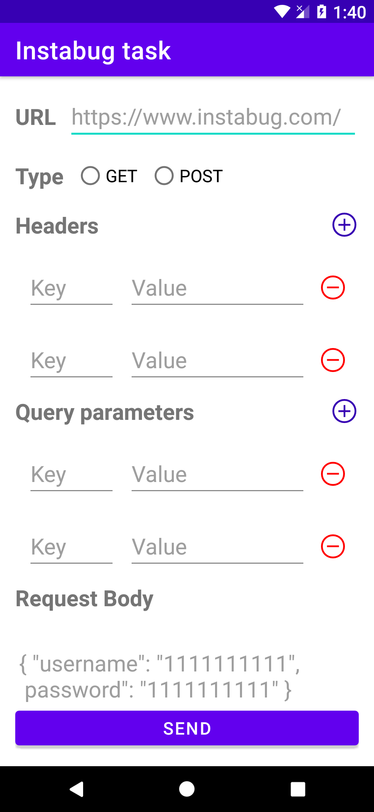
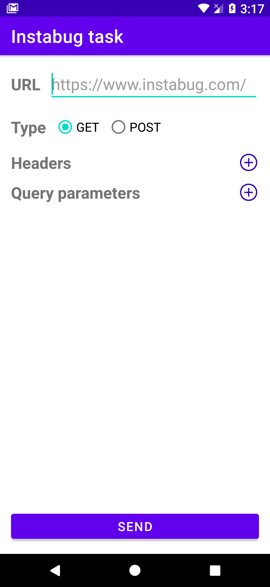
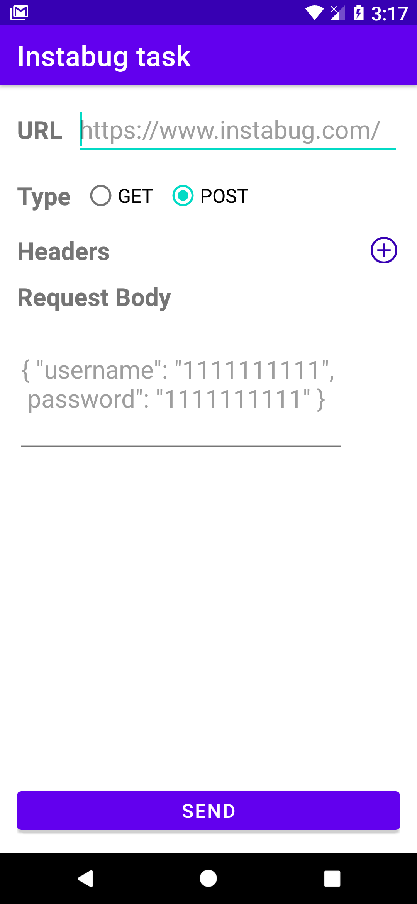
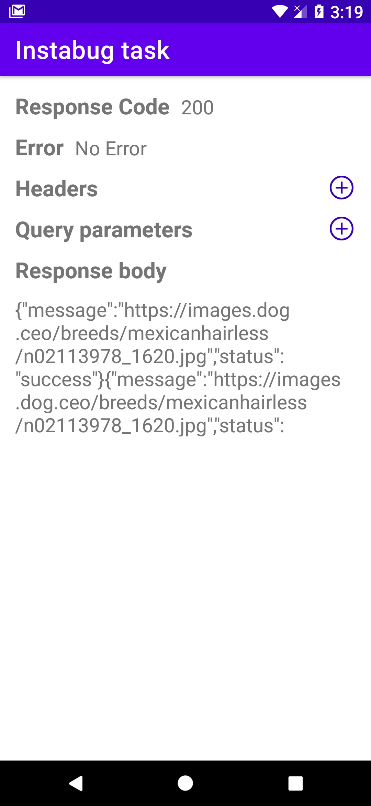
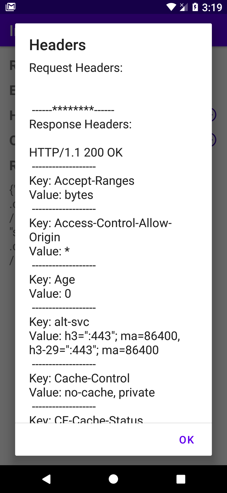
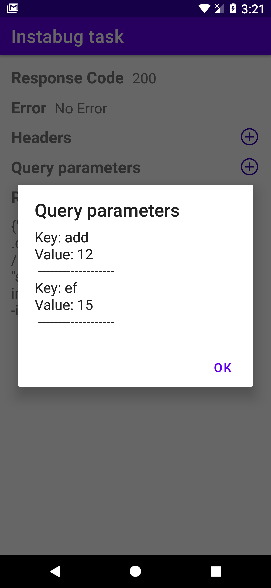

# Instabug-task
### App screenshots

  
  
  
  
  
  

### APK Download:
[Click here](https://soundcloud.com/discover)
### Requriments:
We need you to create an application that will help in testing backed APIs.
This application must allow us to do the following:
1. Enter URL to connect to
2. Add request headers which numbers are dynamic
3. App must support GET/POST
a. For POST request type, App must provide a way to enter
request body as string
4. After request completion the app needs to display the following:
a. Response code
b. Error if any
c. Request/Response headers
d. Request body or query parameters depending on request type
/Response body
5. If the device is offline then app must show an error message and do
not make the call

### Notes:
Your app must not use any third party libraries. We consider (Retrofit,
volley, coroutines, room….etc) as 3rd parties

### Dynamic Headers / query parameters:
Without using List view or Recycler view.

### Validate data:
We validate the  following befor making any API call      
URL using -> REGEX     
Request type (GET / POST) 

### For background tasks:
used: [Executers](https://developer.android.com/reference/java/util/concurrent/Executors)

### For Network Calls:
used: [HttpURLConnection](https://developer.android.com/reference/java/net/HttpURLConnection)

### Endpoints for test:
[Daily cat facts](https://alexwohlbruck.github.io/cat-facts/docs/)

